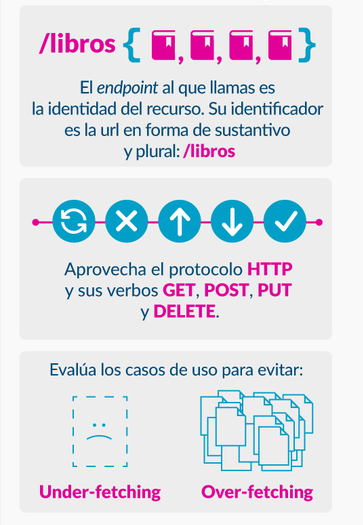

# API Rest - Python

una rest API no es más que un servidor que responde datos en formato json


## Generar Tags del proyecto

```
git tag -a v1.0.0 -m "Inicio WebServer"
git push --tags

# delete local tag 'v1.0.0'
git tag -d v1.0.0
# delete remote tag 'v1.0.0' (eg, GitHub version too)
git push origin :refs/tags/v1.0.0

# alternative approach
git push --delete origin tagName
git tag -d tagName

git rm .env --cached (Borrar seguimiento)
```

## Subir a Heroku

```
heroku git:remote -a restserver001node

# Repetir proceso luego de cambio en el proyecto

git branch
git push heroku main
```

## Crear - borrar variables de entorno Heroku

```
heroku --version
heroku config
heroku config:set nombre="Guillermo"
heroku config:unset nombre
```

## Logs en heroku

```
heroku logs -n 100 -a
heroku logs -n 100 --tail
```


## {REST}  (Representational State Transfer)

Es un estilo de **arquitectura para servicios web** creado en el año 2000 por Roy Fielding


